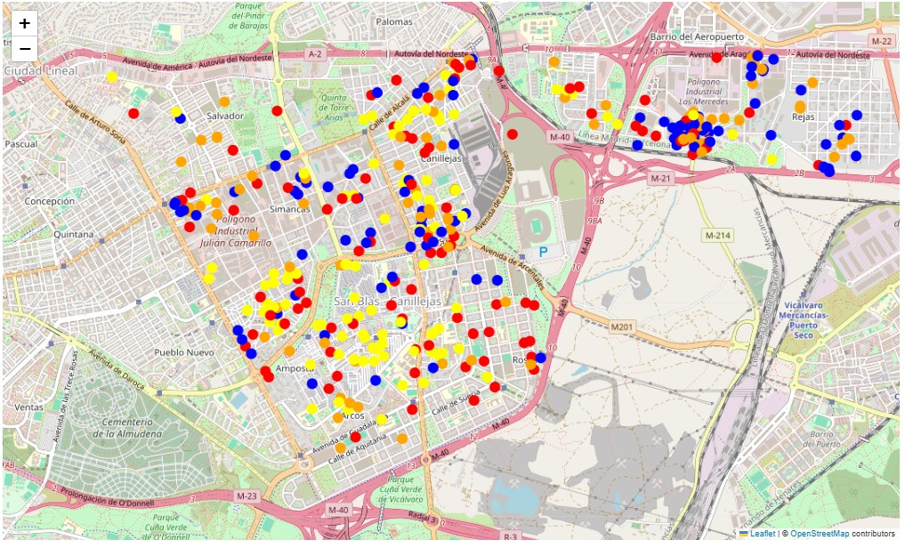
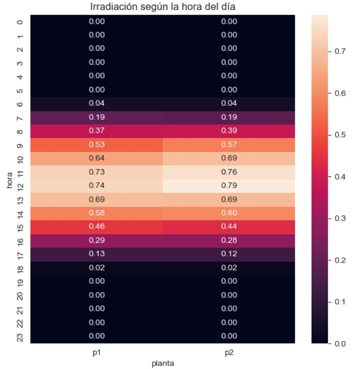
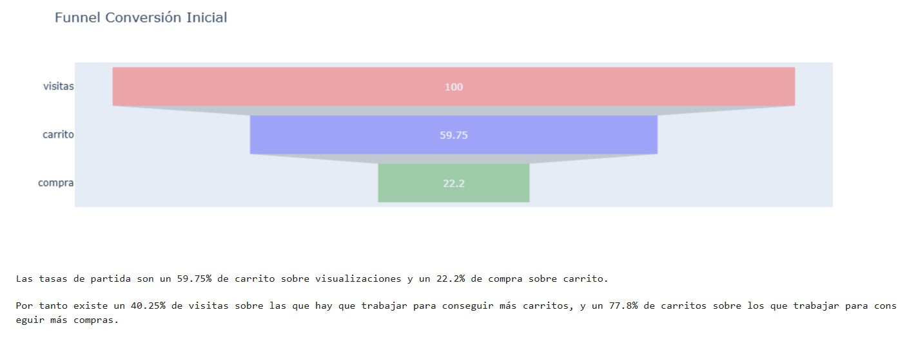

# Portafolio de Análisis de Datos 📉📊📈
¡Bienvenido a mi portafolio de análisis de datos en GitHub! En este repositorio, encontrarás una colección de mis proyectos principales de análisis y ciencia de datos, así como un resumen de los KPIs, palancas y conclusiones obtenidas de cada uno.
## Autor
* LinkedIn: [**Sergi Martínez Castro**](www.linkedin.com/in/sergi-martínez-castro-b53457294)

## [Resultados del proyecto de inversión inmobiliaria en Madrid](https://github.com/Sergicas01/portfolio/blob/main/Resultados%20del%20proyecto%20de%20inversi%C3%B3n%20inmobiliaria%20en%20Madrid.ipynb)
La empresa ha seleccionado la ciudad de Madrid como candidata para buscar inmuebles en los que invertir con el objetivo de obtener rentabilidad mediante alquiler turístico.

Las palancas que influyen sobre el objetivo de negocio son:
* **Precio alquiler:** cuanto más se pueda cobrar por noche mayor es la rentabilidad
* **Ocupación:** en general cuantos más días al año se pueda alquilar un inmueble mayor es su rentabilidad
* **Precio inmueble:** cuanto más barato se pueda adquirir la propiedad mayor es la rentabilidad

Los KPIs son:
* Mediremos la ocupación como el número de días anuales que el inmueble se pueda alquilar
* Mediremos el precio del alquiler como el precio por noche en euros según Airbnb
* Mediremos el precio de un inmueble como la multiplicación entre el número de metros cuadrados y el precio medio del m2 en su zona
### Conclusiones
* Se han localizado 8 barrios en los que centrar la búsqueda
* Se recomienda buscar inmuebles con un habitación que permitan alojar 3 huéspedes
* Se recomienda buscar inmuebles que estando en uno de los barrios identificados no estén necesariamente cerca de puntos de interés
* Se recomienda incrementar el número de reseñas del inmueble en alquiler, ya que favorece a un incremento de la ocupación del mismo.
* Se recomienda evaluar el desarrollo de un nuevo producto basado en el alquier para momentos concretos de alto interés deportivo, especialmente en el barrio de San Blas

## [Resultados del proyecto de detección de ineficiencias en una planta solar](https://github.com/Sergicas01/portfolio/blob/main/Resultados%20del%20proyecto%20de%20detecci%C3%B3n%20de%20ineficiencias%20en%20una%20planta%20solar.ipynb)
En este proyecto para una compañía de generación de energía solar fotovoltaica, se han detectado comportamientos anómalos en 2 de las plantas. Analizamos los datos de los sensores y medidores.

Las palancas que influyen sobre el objetivo de negocio (en este caso generar corriente AC) son:

* **Irradiación:** a mayor irradiación mayor DC generada. Pero no es monotónica, a partir de ciertos valores mayor temperatura puede mermar la capacidad de generación
* **Estado de los paneles:** deben estar limpios y con un correcto funcionamiento para generar la mayor energía DC posible
* **Eficiencia de los inverters:** siempre hay una pérdida en la transformación de DC a AC, pero debe ser la mínima posible. También deben estar en correcto estado y funcionamiento.
* **Medidores y sensores:** si se estropean y no miden bien perdemos la trazabilidad y la posibilidad de detectar fallos

Los KPIs son:
* **Irradiación:** mide la energía solar que llega
* **Temperatura ambiente y del módulo:** medida por los sensores de la planta en grados Celsius
* **Potencia DC:** medida los kw de corriente contínua
* **Potencia AC:** medida los kw de corriente alterna
### Conclusiones
* El hecho de que la generación en DC sea unas 10 veces superior en la planta 1 que en la 2, sumado al hecho de que la eficiencia en la planta 1 esté sobre el 10% nos lleva a pensar que el dato de generación de DC en la planta 1 puede estar artificialmente escalado por algún motivo. A falta de comprobación vamos a asumir que los datos son correctos.
* Aunque la temperatura ambiente es superior en la planta 2 y sus módulos se calientan más que los de la planta 1 esto no parece tener un impacto significativo
* La generación de DC de la planta 1 funciona bien, los módulos parecen llevar DC a los inverters.
* La generación de DC de la planta 2 NO funciona bien, algunos módulos llevan muy poco DC a los inverters incluso en las horas de mayor irradiación.
* La transformación de DC a AC de la planta 1 NO funciona bien, solo se transforma en torno al 10%, eso sí, de forma constante. Y esta baja eficiencia no es debida a momentos de no recepción de DC ni se concentra en inverters concretos, si no que parece más estructural.
* La transformación de DC a AC de la planta 2 funciona bien, ya que una vez eliminados los períodos de generación cero de DC el resto tienen una eficiencia superior al 97%

## [Resultados del proyecto de optimización de un ecommerce](https://github.com/Sergicas01/portfolio/blob/main/Resultados%20del%20proyecto%20de%20optimizaci%C3%B3n%20de%20un%20ecommerce.ipynb)
En este caso realizamos el análisis para un ecommerce del sector cosméticos. Analizamos los datos transaccionales para intentar potenciales acciones CRO que incrementen visitas, conversiones y ticket medio, y por tanto incrementar la facturación global del ecommerce.

## Conclusiones
Tras el análisis realizado sobre los datos transaccionales se ha desarrollado un plan CRO de 12 iniciativas concretas organizadas en 5 grandes palancas de negocio que con alta probabilidad van a incrementar los baselines consiguiendo un incremento global de los ingresos del ecommerce. En cada sesión, de media:

* KPIs por sesión: Se ven 2.2 productos
* KPIs por sesión: Se añaden 1.3 productos al carrito
* KPIs por sesión: Se eliminan 0.9 productos del carrito
* KPIs por sesión: Se compran 0.3 productos
* Venta cruzada: mediana de 5 productos por compra
* Recurrencia: el 10% de los clientes vuelve a comprar tras el primer mes
* Conversión: 60% de añadir al carrito sobre visualizaciones
* Conversión: 22% de compra sobre añadidos a carrito
* Conversión: 13% de compra sobre visualizaciones
* Facturación media mensual: 125.000€

**Acciones de incremento de visualizaciones:**
* Revisar las campañas de paid (generación y retargeting) para concentrar la inversión en franjas entre las 9 y las 13 y entre las 18 y las 20
* Concentrar la inversión del período navideño y post-navideño en la semana del black friday
* Incrementar la inversión hasta llegar al CPA máximo en base al LTV que hemos identificado (el LTV medio es de 42€).

**Acciones de incremento de conversión:**
* Preconfigurar la home con los productos identificados en los análisis most viewed y most sold.
* Trabajar sobre los productos con alta tasa de abandono de carrito
* Trabajar sobre los productos muy vistos pero poco comprados

**Acciones de incremento de venta cruzada:**
* La compra mediana incluye 5 productos
* Incrementar este ratio mediante la recomendación en tiempo real con el nuevo recomendador

**Acciones de incremento de frecuencia de compra:**
* El 90% de los clientes sólo hace una compra
* Crear una newsletter periódica con el nuevo recomendador para incrementar la frecuencia de visita
* Campañas promocionales sobre los segmentos top de la segmentación RFM

**Acciones de fidelización de clientes:**
* Crear un programa de fidelización segmentado por la nueva segmentación RFM

