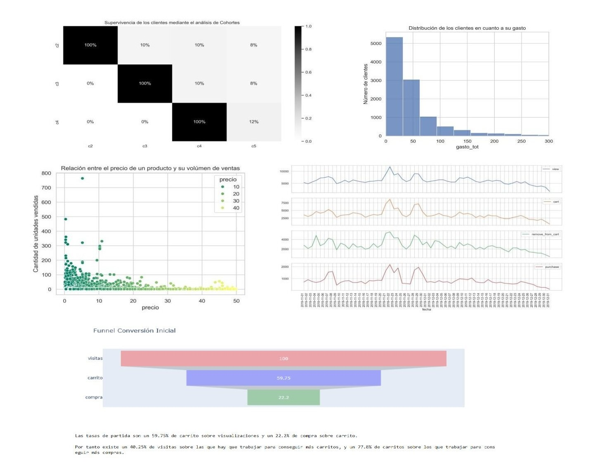

# Portafolio de Ciencia de Datos 📉📊📈
¡Bienvenido a mi portafolio de análisis de datos en GitHub! En este repositorio, encontrarás una colección de mis proyectos principales de análisis y ciencia de datos, así como un resumen de los KPIs, palancas y conclusiones obtenidas de cada uno.

📌Al hacer click en el titular de cada proyecto podrás acceder a los informes, dashboards y detalles de cada proyecto.

LinkedIn: [**Sergi Martínez Castro**](www.linkedin.com/in/sergi-martínez-castro-b53457294) |📩 Contáctame si deseas ver el proyecto completo.

## [Análisis de inversión inmobiliaria en Madrid](https://github.com/Sergicas01/portfolio/blob/main/Resultados%20del%20proyecto%20de%20inversi%C3%B3n%20inmobiliaria%20en%20Madrid.ipynb)
**Objetivo:** Invertir en inmuebles para alquiler turístico maximizando la rentabilidad.

Las palancas que influyen sobre el objetivo de negocio son:
* **Precio alquiler:** A mayor precio por noche, mayor rentabilidad.
* **Ocupación:** Más días alquilados al año aumentan la rentabilidad.
* **Precio inmueble:** Cuanto más bajo el precio de compra, mayor rentabilidad.

Los KPIs son:
* Mediremos la ocupación como el número de días anuales que el inmueble se pueda alquilar
* Mediremos el precio del alquiler como el precio por noche en euros según Airbnb
* Mediremos el precio de un inmueble como Metros cuadrados × precio medio €/m² de la zona.
### Conclusiones
* Focalizar la búsqueda en 8 barrios identificados.
* Priorizar inmuebles de 1 habitación con capacidad para 3 huéspedes.
* Buscar inmuebles que estando en uno de los barrios identificados no estén necesariamente cerca de puntos de interés
* Aumentar las reseñas en Airbnb para mejorar la ocupación.
* Evaluar un producto de alquiler enfocado en eventos deportivos, especialmente en San Blas: [Mapa de oportunidades de inversión.](https://sergicas01.github.io/hosting/)

## [Detección de ineficiencias en una planta solar](https://github.com/Sergicas01/portfolio/blob/main/Resultados%20del%20proyecto%20de%20detecci%C3%B3n%20de%20ineficiencias%20en%20una%20planta%20solar.ipynb)
**Objetivo:** Identificar las causas de los comportamientos anómalos en dos plantas de generación fotovoltaica.

Las palancas que influyen sobre el objetivo de negocio (en este caso generar corriente AC) son:

* **Irradiación:** A mayor irradiación, mayor generación de DC, aunque temperaturas altas pueden reducir la eficiencia.
* **Estado de los paneles:** Deben estar limpios y en buen estado para maximizar la generación de DC.
* **Eficiencia de los inverters:** La conversión de DC a AC debe minimizar pérdidas.
* **Medidores y sensores:** Su correcto funcionamiento es clave para la trazabilidad y detección de fallos.

Los KPIs son:
* **Irradiación:** mide la energía solar recibida
* **Temperatura ambiente y del módulo:** medida por los sensores de la planta en grados Celsius
* **Potencia DC:** Energía generada en corriente continua (kW).
* **Potencia AC:** Energía convertida en corriente alterna (kW).
### Conclusiones

**Planta 1:**
* La generación de DC es 10 veces superior a la de la planta 2, pero podría estar artificialmente escalada.
* La conversión de DC a AC es ineficiente (~10%), de forma constante y estructural.

**Planta 2:**
* La temperatura más alta no afecta significativamente el rendimiento.
* La generación de DC es deficiente, con módulos que producen poco incluso en alta irradiación.
* La conversión de DC a AC es eficiente (>97%) cuando hay generación de DC.

## [Optimización de un ecommerce](https://github.com/Sergicas01/portfolio/blob/main/Resultados%20del%20proyecto%20de%20optimizaci%C3%B3n%20de%20un%20ecommerce.ipynb)
**Objetivo:** Identificar acciones de optimización (CRO) que aumenten visitas, conversiones y ticket medio, con el objetivo de incrementar la facturación global.

### Conclusiones
Se diseñó un plan CRO con 12 iniciativas en 5 áreas clave para mejorar los KPIs y aumentar los ingresos del ecommerce.

* visualizaciones por sesión: 2.2 productos vistos
* Carrito por sesión: 1.3 productos añadidos, 0.9 eliminados
* Compra por sesión: 0.3 productos adquiridos
* Venta cruzada: mediana de 5 productos por compra
* Recurrencia: el 10% de los clientes vuelve a comprar tras el primer mes
* Conversión: 60% de añadir al carrito sobre visualizaciones
* Conversión: 22% de compra sobre añadidos a carrito
* Conversión: 13% de compra sobre visualizaciones
* Facturación media mensual: 125.000€

**Acciones de incremento de visualizaciones:**
* Optimizar campañas de pago en horarios clave (9-13h, 18-20h).
* Focalizar inversión navideña en Black Friday.
* Ajustar CPA según LTV (42€).

**Acciones de incremento de conversión:**
* Destacar en la home productos más vistos y vendidos.
* Optimizar productos con alta tasa de abandono de carrito o baja conversión.

**Acciones de incremento de venta cruzada:**
* Aumentar la compra media (>5 productos) con recomendaciones en tiempo real.

**Acciones de incremento de frecuencia de compra:**
* El 90% de los clientes sólo hace una compra
* Enviar newsletter con recomendaciones personalizadas.
* Campañas promocionales para clientes top (segmentación RFM).

**Acciones de fidelización de clientes:**
* Implementar programa de fidelización basado en RFM.

## [Risk Score](https://appriesgos-de6kqmafhuytzmcu6hzwba.streamlit.app/)
**Objetivo:** ¿Cuál es el precio al que deberíamos conceder el prestámo? Para averiguarlo utilizaremos la siguiente fórmula: 
* Expected Loss = Probability of Default * Principal * Exposure at Default * Loss Given Default

Por tanto desarrollamos 3 modelos para finalmente combinarlos todos y calcular la pérdida esperada:
* Modelo de clasificación para PD (probabilidad de impago): Regresión logística
* Modelo de regresión para EAD (% del principal que no había sido amortizado): Light GBM
* Modelo de regresión para LGD (% del pendiente que NO se recupera en caso de impago): Light GBM

Las variables son:
* **Historial de pagos y deudas:** Número de cancelaciones de préstamos, retrasos en pagos, número de hipotecas, líneas de crédito abiertas y derogatorios.
* **Datos del préstamo:** importe total, mensualidad, tipo de interés, número de cuotas iniciales, importe amortizado, estado del préstamo y finalidad.
* **Situación financiera del cliente:** Ratio deuda-ingresos, porcentaje de uso del crédito revolving, importe recuperado en impagos.
* **Información personal y laboral:** Antigüedad en el empleo, tipo de empleo, titularidad de la vivienda, verificación de ingresos.

📌Al hacer click en el titular de este proyecto podrás acceder a la siguiente aplicación alojada en Streamlit:

## [Lead Scoring]
**objetivo:** Desarrollar un modelo de Lead Scoring basado en machine learning para calificar leads de manera eficiente, evitando la saturación del canal, minimizando quejas de los comerciales y maximizando resultados. Además, se aplicará segmentación no supervisada para analizar el tipo de leads que captura la empresa.

Por tanto desarrollamos 2 modelos:

*Modelización para no supervisado (segmentación): Kmeans.
*Modelización para Clasificacion: Regresión logística.

Las variables son:
* **Origen:** Canal principal por el cual el lead ingresó al sistema (ej. orgánico, pagado, referido)
* **Fuente:** Plataforma o medio específico que generó el lead (ej. Google, Facebook, Email)
* **Ult_actividad:** Última interacción registrada del lead con la plataforma/contenido
* **Visitas_total:** Número acumulado de visitas realizadas al sitio
* **Tiempo_en_site_total:** Duración acumulada en el sitio (generalmente en segundos/minutos)
* **Paginas_vistas_visita:** Promedio de páginas visitadas por sesión
* **Descarga_lm:** Indicador binario de si el lead ha descargado material informativo
* **Ambito:** Sector o industria donde opera el lead
* **Ocupacion:** Rol o posición profesional del lead
* **Score_actividad:** Puntuación derivada del comportamiento y engagement del lead
* **Score_perfil:** Puntuación basada en características demográficas y profesionales

Técnicas utilizadas en el proyecto y las variables afectadas:

EDA (Análisis Exploratorio de Datos)
* Eliminar registros con datos inconsistentes en todas las variables principales.
* Verificar tipos de datos para asegurar consistencia.
* Eliminar duplicados en todas las variables clave.

Manejo de valores nulos
* Imputación por valor en varias variables de comportamiento y puntuación.
* Imputación por moda en variables categóricas como "ámbito" y "ocupación".
* Imputación por mediana en varias métricas numéricas para estabilidad.

Manejo de valores atípicos
* Identificación de categorías raras en variables categóricas.
* Winsorización manual para limitar valores extremos en "páginas_vistas_visita".

Transformaciones
* One-Hot Encoding (OHE) para variables categóricas como "ámbito" y "ocupación".
* MinMax Scaling (MMS) para normalizar métricas numéricas como "score_actividad" y "tiempo_en_site_total".

## [Forecasting Retail](https://github.com/Sergicas01/Forecasting-Retail)
**objetivo:** ¿Cuáles serán las ventas de los próximos días por tienda y producto? Reducir gastos (costes de almacén y coste de capital) e incrementar ingresos (reducir roturas de stock) desarrollando modelos de machine learning sobre una base de datos que tiene 3 años de histórico para predecir las ventas de los próximos 8 días a nivel de tienda-producto.

Las variables son:
* **Datos temporales y eventos:** Fecha, día de la semana, mes, eventos especiales.
* **Identificadores:** Producto, tienda.
* **Datos de stock y precios:** Rotura de stock en diferentes períodos, precio de venta retrasado.
* **Historial de ventas:** Ventas pasadas en distintos períodos.
* **Máximos y mínimos de ventas:** Máximos y mínimos en distintos períodos.
* **Media móvil de ventas:** Ventas promedio en distintos períodos.

Técnicas utilizadas en el proyecto y las variables afectadas:

EDA (Análisis Exploratorio de Datos)
* Verificación de tipos de datos en variables como "month" y "weekday" para asegurar consistencia.
* Manejo de valores nulos

* Imputación por valor en "event_name_1".
* Imputación por moda en "item_id" para valores categóricos.
* Codificación de variables categóricas

* One-Hot Encoding (OHE) en "event_name_1".
* Target Encoding (TE) en "item_id", "store_id" y "weekday".

Transformaciones temporales
* Lags en "ventas" para capturar tendencias pasadas y predecir futuras fluctuaciones.
* Mínimo móvil, media móvil y máximo móvil en "ventas" para suavizar fluctuaciones y entender la variabilidad.
* Generación de nuevas variables: Creación de "rotura_stock_3", "rotura_stock_7" y "rotura_stock_15" mediante cálculos de lags en "ventas", permitiendo estimar rupturas de stock a diferentes plazos.

📌Al hacer click en el titular de este proyecto podrás acceder al proyecto completo separado en sus distintas fases.

