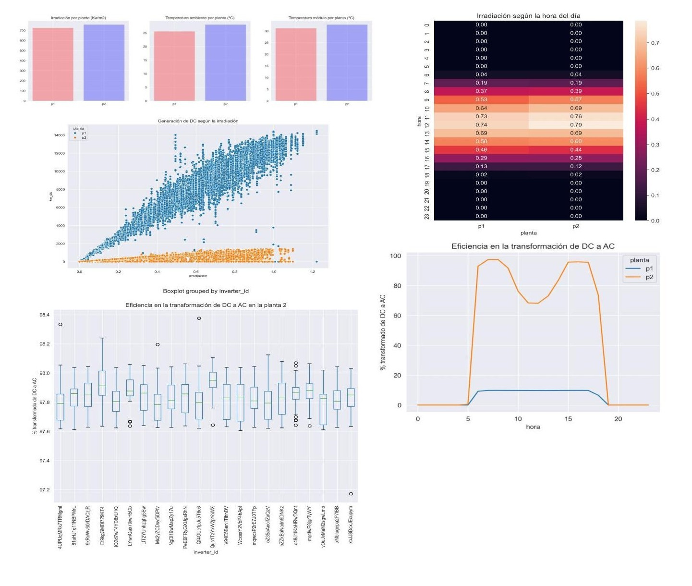
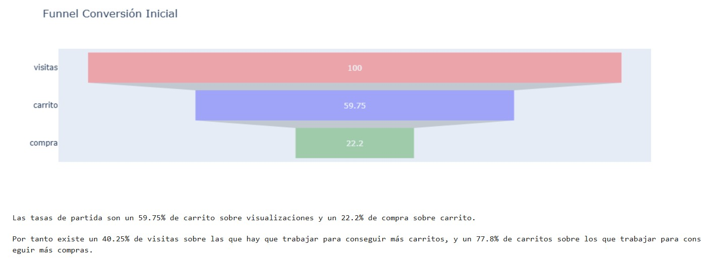

# Portafolio de Análisis de Datos 📉📊📈
¡Bienvenido a mi portafolio de análisis de datos en GitHub! En este repositorio, encontrarás una colección de mis proyectos principales de análisis y ciencia de datos, así como un resumen de los KPIs, palancas y conclusiones obtenidas de cada uno.

📌Al hacer click en el titular de cada proyecto podrás acceder a los informes, dashboards y detalles de cada proyecto.

LinkedIn: [**Sergi Martínez Castro**](www.linkedin.com/in/sergi-martínez-castro-b53457294) |📩 Contáctame si deseas ver el proyecto completo.

## [Análisis de inversión inmobiliaria en Madrid](https://github.com/Sergicas01/portfolio/blob/main/Resultados%20del%20proyecto%20de%20inversi%C3%B3n%20inmobiliaria%20en%20Madrid.ipynb)
**Objetivo:** Invertir en inmuebles para alquiler turístico maximizando la rentabilidad.

Las palancas que influyen sobre el objetivo de negocio son:
* **Precio alquiler:** A mayor precio por noche, mayor rentabilidad.
* **Ocupación:** Más días alquilados al año aumentan la rentabilidad.
* **Precio inmueble:** Cuanto más bajo el precio de compra, mayor rentabilidad.

Los KPIs son:
* Mediremos la ocupación como el número de días anuales que el inmueble se pueda alquilar
* Mediremos el precio del alquiler como el precio por noche en euros según Airbnb
* Mediremos el precio de un inmueble como Metros cuadrados × precio medio €/m² de la zona.
### Conclusiones
* Focalizar la búsqueda en 8 barrios identificados.
* Priorizar inmuebles de 1 habitación con capacidad para 3 huéspedes.
* Buscar inmuebles que estando en uno de los barrios identificados no estén necesariamente cerca de puntos de interés
* Aumentar las reseñas en Airbnb para mejorar la ocupación.
* Evaluar un producto de alquiler enfocado en eventos deportivos, especialmente en San Blas: [Mapa de oportunidades de inversión.](https://sergicas01.github.io/hosting/)

## [Detección de ineficiencias en una planta solar](https://github.com/Sergicas01/portfolio/blob/main/Resultados%20del%20proyecto%20de%20detecci%C3%B3n%20de%20ineficiencias%20en%20una%20planta%20solar.ipynb)
**Objetivo:** Identificar las causas de los comportamientos anómalos en dos plantas de generación fotovoltaica.

Las palancas que influyen sobre el objetivo de negocio (en este caso generar corriente AC) son:

* **Irradiación:** A mayor irradiación, mayor generación de DC, aunque temperaturas altas pueden reducir la eficiencia.
* **Estado de los paneles:** Deben estar limpios y en buen estado para maximizar la generación de DC.
* **Eficiencia de los inverters:** La conversión de DC a AC debe minimizar pérdidas.
* **Medidores y sensores:** Su correcto funcionamiento es clave para la trazabilidad y detección de fallos.

Los KPIs son:
* **Irradiación:** mide la energía solar recibida
* **Temperatura ambiente y del módulo:** medida por los sensores de la planta en grados Celsius
* **Potencia DC:** Energía generada en corriente continua (kW).
* **Potencia AC:** Energía convertida en corriente alterna (kW).
### Conclusiones

**Planta 1:**
* La generación de DC es 10 veces superior a la de la planta 2, pero podría estar artificialmente escalada.
* La conversión de DC a AC es ineficiente (~10%), de forma constante y estructural.

**Planta 2:**
* La temperatura más alta no afecta significativamente el rendimiento.
* La generación de DC es deficiente, con módulos que producen poco incluso en alta irradiación.
* La conversión de DC a AC es eficiente (>97%) cuando hay generación de DC.

## [Optimización de un ecommerce](https://github.com/Sergicas01/portfolio/blob/main/Resultados%20del%20proyecto%20de%20optimizaci%C3%B3n%20de%20un%20ecommerce.ipynb)
**Objetivo:** Identificar acciones de optimización (CRO) que aumenten visitas, conversiones y ticket medio, con el objetivo de incrementar la facturación global.

## Conclusiones
Se diseñó un plan CRO con 12 iniciativas en 5 áreas clave para mejorar los KPIs y aumentar los ingresos del ecommerce.

* visualizaciones por sesión: 2.2 productos vistos
* Carrito por sesión: 1.3 productos añadidos, 0.9 eliminados
* Compra por sesión: 0.3 productos adquiridos
* Venta cruzada: mediana de 5 productos por compra
* Recurrencia: el 10% de los clientes vuelve a comprar tras el primer mes
* Conversión: 60% de añadir al carrito sobre visualizaciones
* Conversión: 22% de compra sobre añadidos a carrito
* Conversión: 13% de compra sobre visualizaciones
* Facturación media mensual: 125.000€

**Acciones de incremento de visualizaciones:**
* Optimizar campañas de pago en horarios clave (9-13h, 18-20h).
* Focalizar inversión navideña en Black Friday.
* Ajustar CPA según LTV (42€).

**Acciones de incremento de conversión:**
* Destacar en la home productos más vistos y vendidos.
* Optimizar productos con alta tasa de abandono de carrito o baja conversión.

**Acciones de incremento de venta cruzada:**
* Aumentar la compra media (>5 productos) con recomendaciones en tiempo real.

**Acciones de incremento de frecuencia de compra:**
* El 90% de los clientes sólo hace una compra
* Enviar newsletter con recomendaciones personalizadas.
* Campañas promocionales para clientes top (segmentación RFM).

**Acciones de fidelización de clientes:**
* Implementar programa de fidelización basado en RFM.

